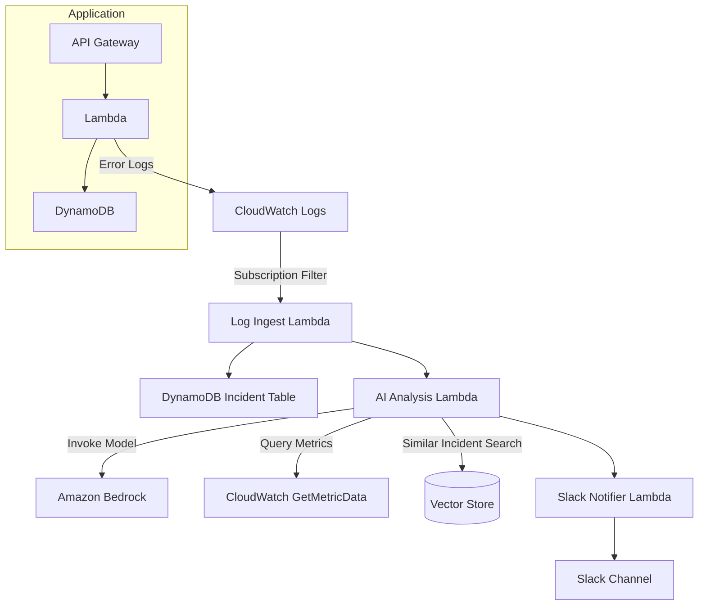

# AI SRE (Site Reliability Engineering) アシスタント  
システムのエラー発生時に LLM に SRE 思考プロセスを踏ませて、原因分析 & 取るべきアクションを提示させるシステム 
1. 事実整理  
2. 仮説生成  
3. 検証  
4. 結論  
5. 次アクション提示  

## アーキテクチャイメージ

```mermaid
flowchart TD

subgraph Application
    APIGW[API Gateway]
    LAMBDA[Lambda]
    DDB[DynamoDB]
end

APIGW --> LAMBDA
LAMBDA --> DDB

LAMBDA -->|Error Logs| CWL[CloudWatch Logs]
CWL -->|Subscription Filter| LogsLambda[Log Ingest Lambda]

LogsLambda --> IncidentTable[DynamoDB Incident Table]
LogsLambda --> AnalyzerLambda[AI Analysis Lambda]

AnalyzerLambda -->|Invoke Model| Bedrock[Amazon Bedrock]
AnalyzerLambda -->|Query Metrics| CloudWatchMetrics[CloudWatch GetMetricData]
AnalyzerLambda -->|Similar Incident Search| OpenSearch[(Vector Store)]

AnalyzerLambda --> SlackNotifier[Slack Notifier Lambda]
SlackNotifier --> Slack[Slack Channel]
```
