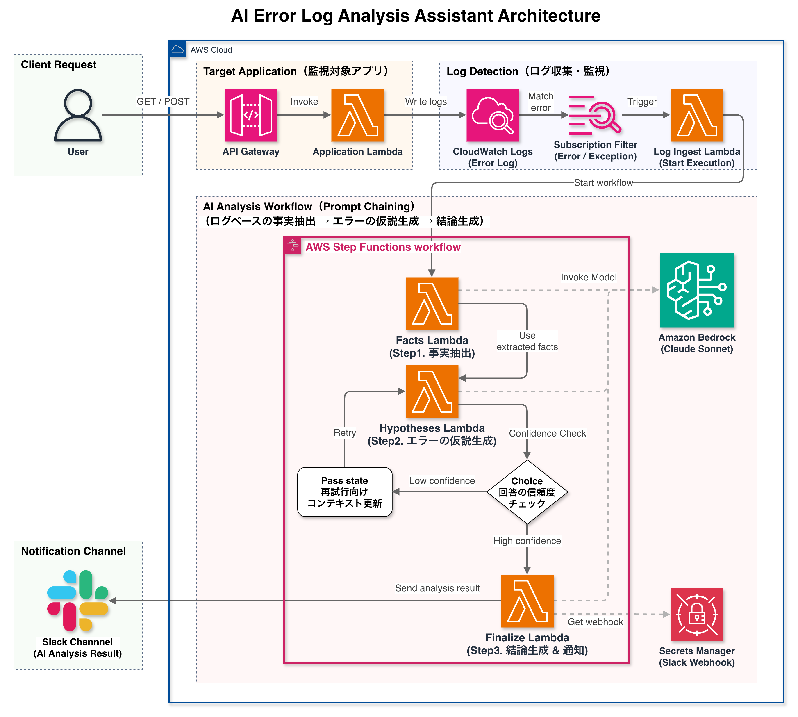
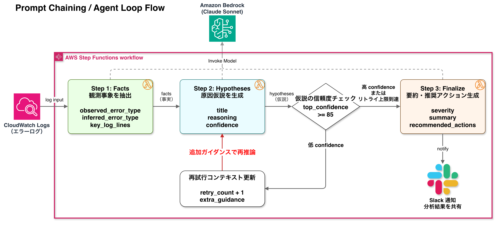
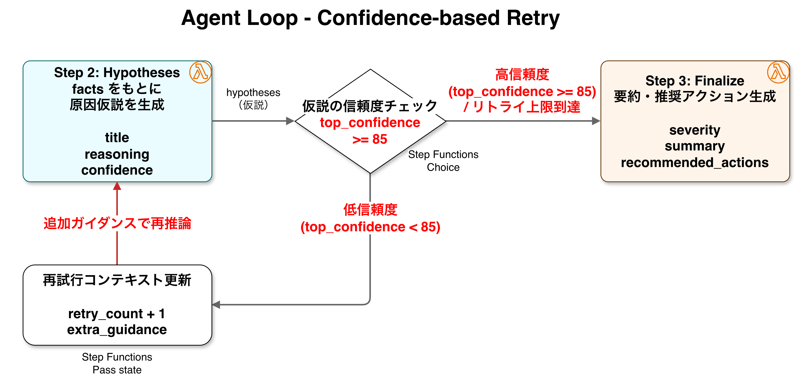
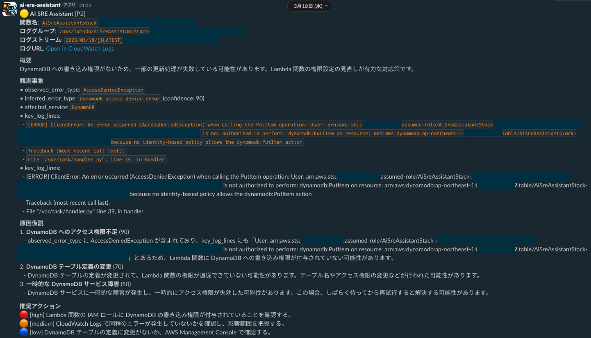
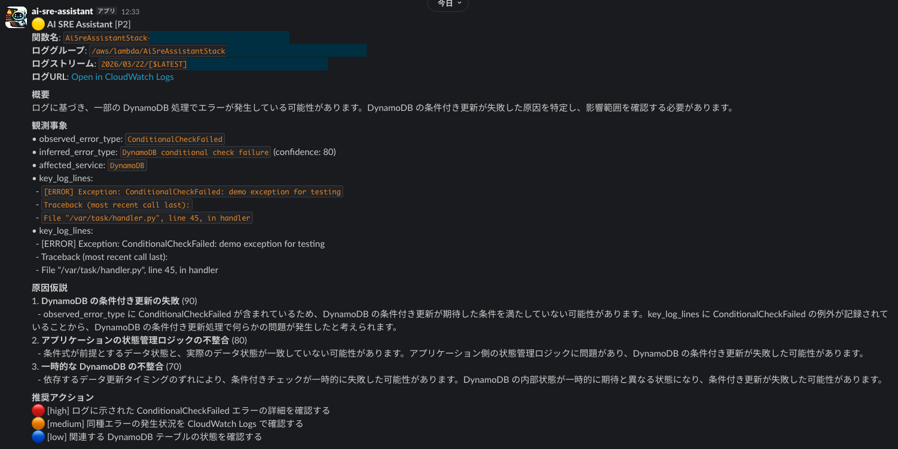
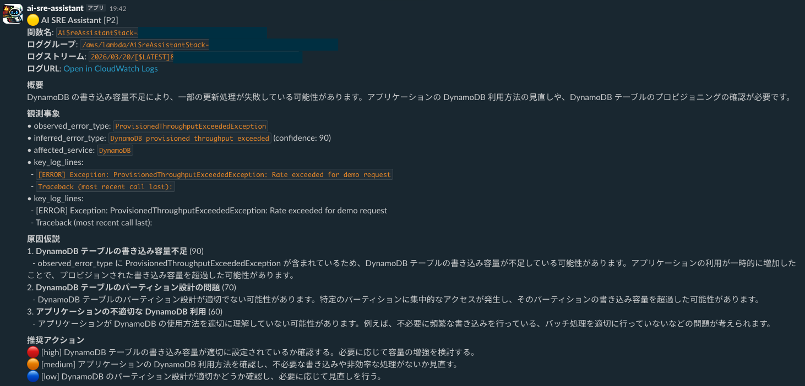
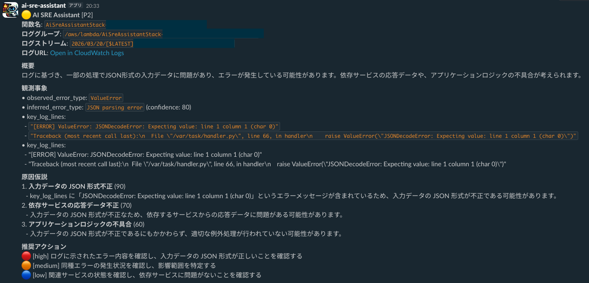
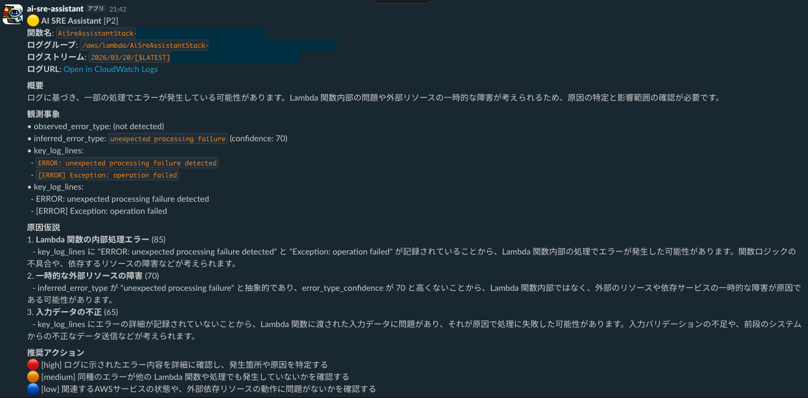

# AI SRE アシスタント

AI SRE アシスタントは LLM を用いて CloudWatch Logs を解析し、  
インシデントの原因分析を自動生成する **AI支援SREツールのプロトタイプ** である  
*SRE: Site Reliability Engineering*  

Step Functions による **LLM推論オーケストレーション**と Amazon Bedrock（Claude）を組み合わせ、  
ログから以下の情報を自動生成する  

- 観測事象（Facts）
- 原因仮説（Hypotheses）
- インシデント要約（Summary）
- 推奨アクション（Recommended actions）

本システムはインシデント分析・対応という実務上の課題を、  
以下の技術検証・学習を兼ねて実装することをテーマに作成した  

- LLM オーケストレーション（Step Functions による Prompt Chaining）
- サーバレスな AIアーキテクチャ（Bedrock + Lambda）
- プロンプトエンジニアリング
- LLM 出力構造化

------------------------------------------------------------------------

# システムの目的

インフラ・アプリのインシデント対応では以下の作業に多くの時間がかかる

-   ログ調査
-   エラー分類
-   原因推定
-   対処方針の検討

本システムはこれらを **LLM推論パイプライン**として自動化し、
初期対応の高速化を目的としている

------------------------------------------------------------------------

# システムアーキテクチャ

------------------------------------------------------------------------

# なぜ Step Functions を使うのか

本システムでは、LLM を単なるチャットではなく、  
「状態を持つ推論システム」として扱うことを重視している  

Step Functions を利用することで、  
各推論ステップの状態管理、分岐、再試行、入出力保持をシステム側で明示的に制御できる  

これにより、以下を実装しやすくしている  

- 推論過程の追跡
- confidence による制御
- Agent Loop
- 将来的な調査型 Workflow 拡張

------------------------------------------------------------------------

# AI 推論フロー（Prompt Chaining）

Facts → Hypotheses → Finalize の3段階で推論を行う  

このように、インシデント分析を単一の LLM で行うのではなく、  
複数の LLM 推論を段階的に実行する **Prompt Chaining** を採用している  

メリットは以下となる  

- 推論精度向上
- 推論過程の可視化
- デバッグ容易性
- プロンプト制御性

------------------------------------------------------------------------

# Agent Loop

仮説の信頼度（confidence）に応じて、  
Hypotheses（仮説生成ステップ）を再実行する **Agent Loop** を実装

## 特徴

- confidence ベースの分岐（Step Functions Choice）
- retry_count、max_retries によるループ制御（無限ループ防止）
- 再試行時に追加プロンプト（extra_guidance）を付与

## 現在のアプローチ

- 再試行では「追加ガイダンス」による推論改善を実施
- 新たな外部データ取得は行わず、プロンプト制御による推論精度向上を試みる設計

## 今後の改善ポイント

- 再試行時のログ探索範囲の拡張（幅広い視点で推論させる）
- CloudWatch Metrics 連携（推論生成の参考情報の追加）

------------------------------------------------------------------------

# サンプル出力
以下の画像は実際にエラー分析を実行した際の Slack 通知内容となる  

1. 権限不足エラー（AccessDeniedException）  

2. DynamoDB 条件付き書き込みエラー（ConditionalCheckFailed）  

3. スロットリングエラー（ProvisionedThroughputExceededException）  

4. JSON 形式エラー（JSONDecodeError）  

5. 曖昧なエラー（not detected）  

------------------------------------------------------------------------

# 設計の工夫ポイント

本システムでは、単一の LLM 呼び出しでインシデント分析を完結させるのではなく  
**Facts → Hypotheses → Analysis** の3段階に推論を分割している

この構成を採用した理由について、次のことが挙げられる

### ① 推論精度の向上

インシデント分析を以下の3段階に分割することで、各ステップの役割が明確になり推論精度が向上する

- 事象抽出
- 原因の仮説生成
- 最終判断

### ② 推論過程の可視化

Step Functions により各ステップの入出力を保持することで LLM がどのような情報を元に判断したかを追跡できる

これはインシデント分析において重要な
**説明可能性（Explainability）** の確保にもつながる

### ③ 観測事象と推定の分離

ログから直接確認できる事実と LLM が推定した情報を区別し、分けて出力している

- `observed_error_type`
- `inferred_error_type`

これにより以下を明確に区別できるような設計にしている

- ログに基づく確定情報
- LLM による推定

### ④ LLM の不確実性を前提とした設計

LLM の出力は必ずしも安定しないため、
confidence による分岐や再試行（Agent Loop）を設けることで、
推論結果のばらつきを制御する設計とした

### ⑤ 将来拡張しやすいアーキテクチャ

Step Functions を採用することで、将来的に以下のような拡張を容易に追加できる

- Choice 分岐による追加調査
- Agent 型のインシデント調査フロー
- メトリクスや関連ログの追加取得

------------------------------------------------------------------------

# 苦労したポイント

### 出力形式（日本語表記、JSONなど）の指示を LLM が守らないケースがある
- エラーに繋がるため、守らなかった場合を想定した構造化処理の実装が必要となった  

### プロンプトに記載した出力の具体例を、そのまま出力してくることがある
- 具体例は出力形式を安定させるのに有効だが、流用できないように抽象化させた方が良い

### 生成した回答の confidence を LLM 自身が高く評価しがち
- 仮説生成ステップの top_confidence が常に 80~90 になる
    - おそらく「仮説を生成できた」時点で高評価となるため、LLM が必要以上に評価を高くしないような指示が必要
- Agent loop で confidence を基準に再試行の判断をする場合、実際の出力を確認しながらの閾値調整が必要となる
  
総じて、LLM を実運用に組み込む際は、
「プロンプト設計」だけでなく「制御ロジック（Step Functions等）」との組み合わせが重要であると実感した

------------------------------------------------------------------------

# 技術スタック

AWS

- AWS CDK (TypeScript)
- AWS Lambda (Python)
- Amazon Bedrock (Claude 3)
- AWS Step Functions
- CloudWatch Logs
- API Gateway

Integration

- Slack Webhook

AI Engineering

- Prompt Engineering
- Prompt Chaining
- Agent Loop
- Structured LLM Output
- LLM Orchestration

------------------------------------------------------------------------

# 今後の拡張（予定）

- 調査型 Agent Loop
- 類似インシデント検索（Vector DB / RAG）
- CloudWatch Metrics 分析
- コスト制御（スロットリング / クールダウン）
